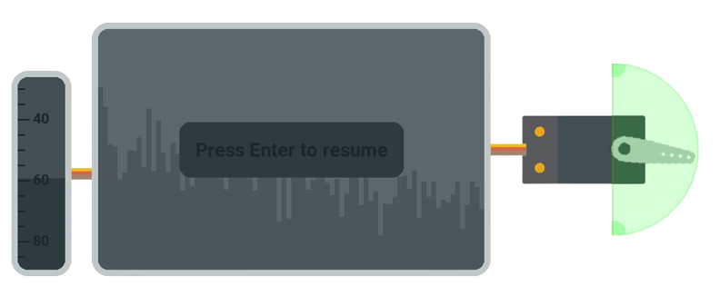

<br />
<p align="center">
  <a href="https://github.com/rmenai/animatronic">
    
  </a>

<h3 align="center">Animatronic</h3>

  <p align="center">
    An advanced animatronic control panel
    <br />
    <a href="https://github.com/rmenai/animatronic"><strong>Explore the docs »</strong></a>
    <br />
    <br />
    <a href="https://github.com/rmenai/animatronic">View Demo</a>
    ·
    <a href="https://github.com/rmenai/animatronic/issues/new?assignees=&labels=&template=bug_report.md&title=">Report Bug</a>
    ·
    <a href="https://github.com/rmenai/animatronic/issues/new?assignees=&labels=&template=feature_request.md&title=">Request Feature</a>
  </p>

<!-- TABLE OF CONTENTS -->
<details open="open">
  <summary>Table of Contents</summary>
  <ol>
    <li>
      <a href="#about-the-project">About The Project</a>
    </li>
    <li>
      <a href="#installation">Installation</a>
      <ul>
        <li><a href="#for-development">For development</a></li>
      </ul>
    </li>
    <li>
      <a href="#environment-variables">Environment Variables</a>
    </li>
    <li><a href="#usage">Usage</a></li>
    <li><a href="#contributing">Contributing</a></li>
    <li><a href="#license">License</a></li>
  </ol>
</details>


<!-- ABOUT THE PROJECT -->

## About The Project

This is an advanced animatronic control panel grouping multiple features such as:
- An audio visualizer rotating a servo in relation with the volume.



<!-- INSTALLATION -->

## Installation

The first step will be to clone the repo

```shell
git clone https://github.com/rmenai/animatronic.git
```

### For development

The requirements are:

* [Python 3.8](https://www.python.org/downloads/) and [Poetry](https://python-poetry.org/docs/)
* [FFmpeg](https://www.ffmpeg.org/)

1. Install the dependencies
   ```shell
   poetry install
   ```

## Environment Variables

To run this project, you will need to add the following environment variables to your .env file.

| Variable | Description        | Default |
|----------|--------------------|---------|
| DEBUG    | Toggles debug mode | False   |

<!-- USAGE EXAMPLES -->

## Usage

Now you are done! You can run the project using

```shell
poetry run task start
```

## Contributing

See [CONTRIBUTING.md](https://github.com/rmenai/animatronic/blob/main/CONTRIBUTING.md) for ways to get started.

<!-- LICENSE -->

## License

Distributed under the MIT License. See [LICENSE](https://github.com/rmenai/animatronic/blob/main/LICENSE) for more information.
